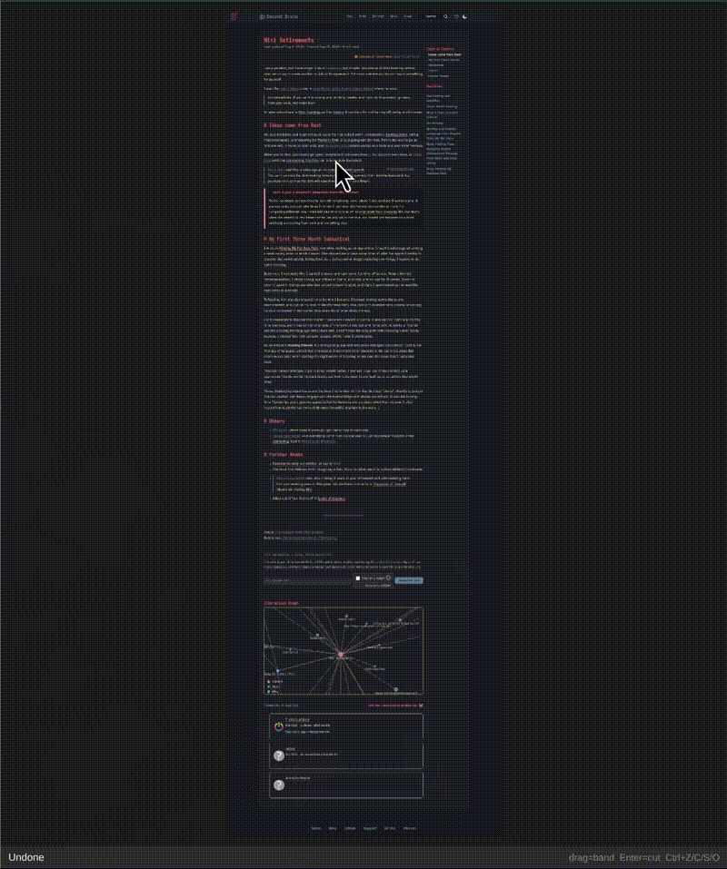
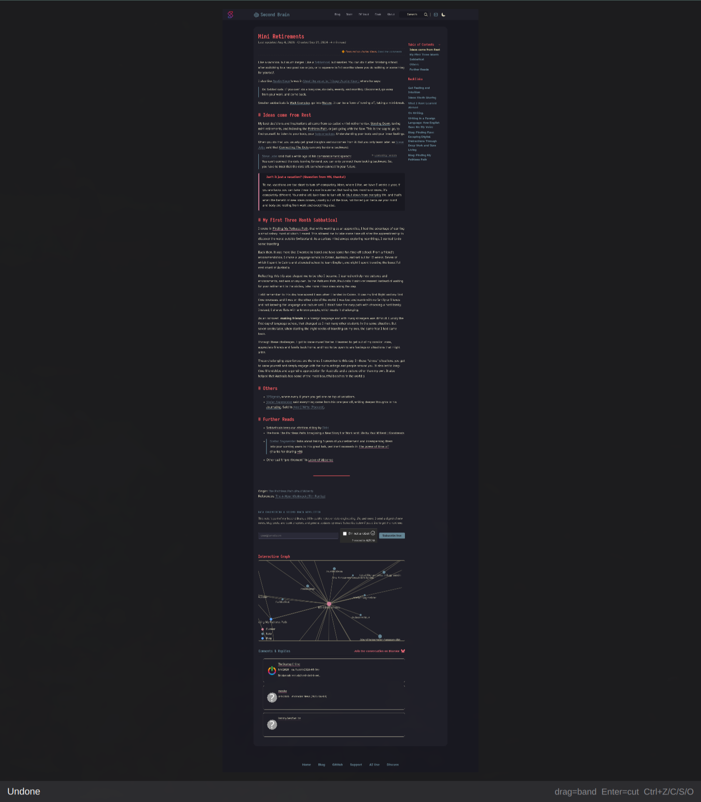
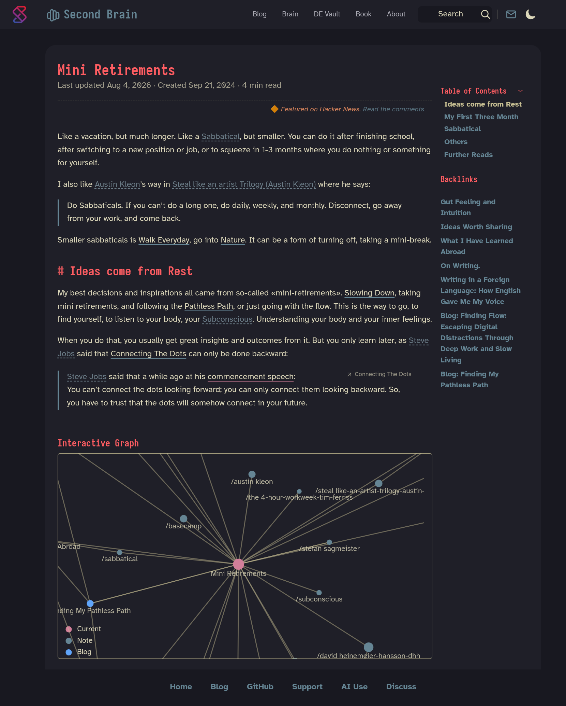

# omapic

A minimal image **cut-out** tool for Wayland/Hyprland/Arch. Open an image, drag a
horizontal or vertical band out of the middle, watch the gap collapse live,
press Enter. Snagit's ["cut out"](https://www.techsmith.com/learn/tutorials/snagit/cut-out/), ported to Linux.

Built like [omacut](https://github.com/omacom-io/omacut): Qt Quick (QML) UI +
a C++ backend compiled to a single binary. Cuts use Qt's `QImage` — no ffmpeg,
no ImageMagick at runtime.

## Video
Short video above cut in action:
 

### Screenshots

Cutting image by importing a long image - see before and after:
|                     Image cut                      |
| :--------------------------------------------------: |
|  |
|  |

## Keys
- **drag** — create a band (drag direction picks horizontal vs vertical)
- **Enter** — apply the cut
- **Ctrl+Z** — undo
- **Ctrl+C** — copy result to clipboard
- **Ctrl+S** — save to `~/Pictures/Printscreen/<YYYY-MM>/`
- **Ctrl+Shift+S** — save as… (native file dialog)
- **Ctrl+O** — open a file
- **Esc** — clear the current band

## Run
    omapic image.png       # open a file
    omapic --clipboard     # load the current clipboard image

## Hyprland keybind
    bindd = SUPER ALT, C, Cut-out image, exec, ~/git/images/omapic/scripts/omapic-capture-cut.sh

## Build
    ./bin/build            # -> build/omapic
    ./bin/test             # run unit tests
    ./bin/install          # build + install the Arch package

Requires: `qt6-base`, `qt6-declarative`, `wl-clipboard`, `xdg-desktop-portal`.

## Makefile

A root `Makefile` wraps the common workflows (run `make help` for the full list):

    make install                 # build + install the system Arch package (makepkg -fsi)
    make uninstall               # remove the installed package
    make run ARGS=image.png      # build then run on the given image
    make test                    # run backend unit tests
    make release VERSION=v0.1.0  # tag+push, bump aur/PKGBUILD, publish to the AUR (all in one)
    make aur-bump VERSION=v0.1.0 # (manual) point aur/PKGBUILD at a tag + refresh checksum
    make aur-publish             # (manual) push aur/PKGBUILD + .SRCINFO to the AUR
    make help                    # list all targets

## Install

omapic is a Qt 6 Wayland app, so it runs on **any** Wayland compositor
(Hyprland, Sway, GNOME, KDE, …) — Arch is only needed for the AUR package, not
to run it. At runtime you need `wl-clipboard` and `xdg-desktop-portal` (with a
portal backend, e.g. `xdg-desktop-portal-hyprland`/`-gtk`/`-kde`) for the
clipboard and file dialogs.

### AUR (Arch & derivatives)

With an AUR helper:

    yay -S omapic        # or: paru -S omapic

Or manually:

    git clone https://aur.archlinux.org/omapic.git
    cd omapic
    makepkg -si

### Other Linux (build from source)

Install the build + runtime dependencies, then build with `qmake6`.

- **Debian / Ubuntu:**

      sudo apt install build-essential qmake6 qt6-base-dev qt6-declarative-dev \
          qml6-module-qtquick-controls qml6-module-qtquick-templates \
          wl-clipboard xdg-desktop-portal

- **Fedora:**

      sudo dnf install gcc-c++ make qt6-qtbase-devel qt6-qtdeclarative-devel \
          wl-clipboard xdg-desktop-portal

(Exact QML-module package names vary by distro; you need Qt 6 Base, Qt
Declarative/Qt Quick, and Qt Quick Controls.)

Then build and run:

    git clone https://github.com/sspaeti/Omapic.git
    cd Omapic
    ./bin/build              # -> build/omapic
    ./build/omapic image.png

Install into your user prefix (no root; `make install` is Arch-only):

    install -Dm755 build/omapic ~/.local/bin/omapic
    install -Dm644 pkgbuild/omapic.desktop ~/.local/share/applications/omapic.desktop
    install -Dm644 pkgbuild/omapic.svg ~/.local/share/icons/hicolor/scalable/apps/omapic.svg

Make sure `~/.local/bin` is on your `PATH`.

## Create release
**Cut a release — one command** (tags use the form `v0.1.0`; no dot after `v`):

    make release VERSION=v0.1.0

That tags + pushes, waits for GitHub's tag tarball, writes the pkgver + sha256
into `aur/PKGBUILD`, regenerates `.SRCINFO`, and pushes it to the AUR. The first
run creates the `omapic` AUR package; later runs update it. (`make aur-bump` /
`make aur-publish` remain available to run those steps by hand.)

## Not yet
- A custom app icon (currently reuses omacut's)

## Roadmap

See at my second brain at [Roadmap](https://www.ssp.sh/brain/omapic#roadmap).
